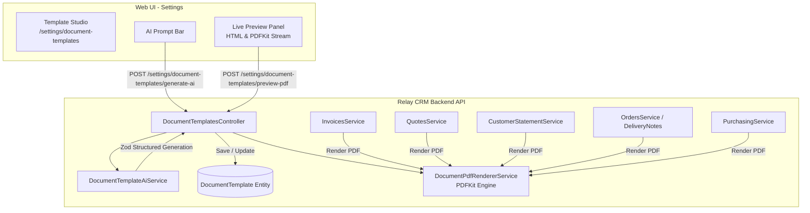

# Design Specification: AI-Powered Universal Document Templates & Statements

**Date:** 2026-09-30  
**Status:** Approved  
**Author:** Pair Programming Session  

---

## 1. Problem Statement & Motivation

Relay CRM generates multiple commercial and operational documents:
* Invoices (currently hardcoded with basic PDFKit layout in `InvoicePdfService`)
* Quotes (currently web-only; no PDF download or email attachment)
* Delivery Notes / Packing Slips (hardcoded PDFKit layout in `PackingSlipPdfService`)
* Purchase Orders (hardcoded PDFKit layout in `PurchaseOrderPdfService`)
* Customer Statements of Account (not yet implemented as a branded printable document)

Currently:
1. Document layouts cannot be customized by tenants (no custom branding, primary colors, headers, footers, terms, bank details, or signature blocks).
2. Code is duplicated across disparate PDF services with manual coordinate calculations.
3. Tenants cannot design or adapt templates using natural language AI instructions.
4. Quotes and Customer Account Statements lack PDF generation capabilities.

---

## 2. Goals & Key Requirements

1. **Universal Document Template Model:**
   * A single, modular configuration schema (`DocumentTemplateConfig`) supporting:
     * **Branding:** Logo URL, primary/secondary colors, typography, layout density, margins.
     * **Header Section:** Layout style (`split`, `centered`, `banner`), company metadata visibility (Tax ID, Phone, Email, Address), custom document title labels.
     * **Parties Section:** Bill To, Ship To, and Supplier information blocks.
     * **Items Table:** Column toggles (Code, Qty, Unit Price, Tax, Discount, Line Total), column alignment, zebra striping.
     * **Totals Section:** Subtotals, discount lines, itemized tax summaries, payment status badges, balance due.
     * **Footer Section:** Bank transfer details, payment terms, custom notes, legal disclaimers, page numbering, signature line.
   * Multi-template management per tenant with per-document-type defaults (`INVOICE`, `QUOTE`, `STATEMENT`, `DELIVERY_NOTE`, `PURCHASE_ORDER`).

2. **AI Template Studio ("Skill"):**
   * Web UI studio under `/settings/document-templates` with natural language prompt input.
   * Users can prompt AI to generate brand-new templates or iterate on existing ones (e.g., *"Make an elegant navy blue corporate template with Net 30 terms and our bank details"*).
   * Backend leverages `AiService.generateStructured` with strict Zod validation and token budget enforcement.
   * Real-time interactive preview in the browser (instant HTML/SVG mock + live PDF preview stream).

3. **Unified High-Performance PDF Engine:**
   * Centralized `DocumentPdfRendererService` built on Node.js **PDFKit**.
   * Deterministic multi-page pagination: dynamic row height calculation, automatic table header repetition across page breaks, and running page footers (`Page X of Y`).
   * Replaces legacy hardcoded PDF services and implements PDF generation for Quotes and Customer Statements.

4. **Customer Statement of Account Engine:**
   * New service aggregating customer ledger transactions (invoices, payments, credit notes) over a selectable period (`from` to `to`).
   * Computes opening balance, transaction movements, closing balance, and aging buckets (Current, 1–30, 31–60, 61–90, 90+ days).

---

## 3. High-Level Architecture



---

## 4. Data Model & Schemas

### 4.1. Entity: `DocumentTemplate`
Defined in `apps/api/src/modules/document-templates/entities/document-template.entity.ts`:

```typescript
@Entity('document_templates')
export class DocumentTemplate {
  @PrimaryGeneratedColumn('uuid')
  id: string;

  @Column({ name: 'organization_id', type: 'uuid' })
  organizationId: string;

  @Column({ type: 'varchar', length: 120 })
  name: string;

  @Column({ type: 'text', nullable: true })
  description: string | null;

  @Column({ name: 'is_default', type: 'boolean', default: false })
  isDefault: boolean;

  @Column({
    name: 'applies_to',
    type: 'text',
    array: true,
    default: '{}',
  })
  appliesTo: Array<'INVOICE' | 'QUOTE' | 'STATEMENT' | 'DELIVERY_NOTE' | 'PURCHASE_ORDER'>;

  @Column({ type: 'jsonb' })
  config: DocumentTemplateConfig;

  @CreateDateColumn({ name: 'created_at' })
  createdAt: Date;

  @UpdateDateColumn({ name: 'updated_at' })
  updatedAt: Date;

  @Column({ name: 'created_by_id', type: 'uuid', nullable: true })
  createdById: string | null;
}
```

### 4.2. Configuration Schema: `DocumentTemplateConfig`
Defined in `packages/shared/src/templates/document-template.schema.ts`:

```typescript
export interface DocumentTemplateConfig {
  branding: {
    logoUrl?: string;
    primaryColor: string;     // Hex e.g. '#1e3a8a'
    secondaryColor: string;   // Hex e.g. '#64748b'
    fontFamily: 'Helvetica' | 'Times-Roman' | 'Courier';
    layoutDensity: 'compact' | 'normal' | 'relaxed';
    margins: { top: number; bottom: number; left: number; right: number };
  };
  header: {
    layout: 'split' | 'centered' | 'banner';
    showLogo: boolean;
    showCompanyTaxId: boolean;
    showCompanyPhone: boolean;
    showCompanyEmail: boolean;
    showCompanyAddress: boolean;
    customLabels: {
      invoice?: string;
      quote?: string;
      statement?: string;
      deliveryNote?: string;
      purchaseOrder?: string;
    };
  };
  parties: {
    billToLabel: string;
    shipToLabel: string;
    supplierLabel: string;
    showTaxId: boolean;
    showEmail: boolean;
    showPhone: boolean;
    showAddress: boolean;
  };
  itemsTable: {
    showItemCode: boolean;
    showDescription: boolean;
    showQuantity: boolean;
    showUnitPrice: boolean;
    showDiscount: boolean;
    showTaxRate: boolean;
    showLineTotal: boolean;
    zebraStriping: boolean;
    headerBackgroundColor?: string;
    headerTextColor?: string;
  };
  totals: {
    showSubtotal: boolean;
    showDiscountTotal: boolean;
    showTaxSummary: boolean;
    showAmountPaid: boolean;
    showBalanceDue: boolean;
    highlightTotal: boolean;
  };
  footer: {
    bankDetails: {
      bankName?: string;
      accountName?: string;
      accountNumber?: string;
      routingOrIban?: string;
      swiftBic?: string;
    };
    paymentTerms?: string;
    notes?: string;
    showSignatureBlock: boolean;
    signatureLabel: string;
    showPageNumbers: boolean;
  };
}
```

---

## 5. Universal Document Data Contract

All services transform their respective entities into `UniversalDocumentData` before calling `DocumentPdfRendererService.render()`:

```typescript
export interface UniversalDocumentData {
  type: 'INVOICE' | 'QUOTE' | 'STATEMENT' | 'DELIVERY_NOTE' | 'PURCHASE_ORDER';
  number: string;
  status: string;
  issuedAt: Date;
  dueDate?: Date;
  validUntil?: Date;
  currency: string;
  organization: {
    name: string;
    logoUrl?: string;
    address?: string;
    taxId?: string;
    phone?: string;
    email?: string;
    website?: string;
  };
  party: {
    name: string;
    companyName?: string;
    address?: string;
    email?: string;
    phone?: string;
    taxId?: string;
  };
  secondaryParty?: {
    label: string;
    name: string;
    address?: string;
    carrier?: string;
    trackingReference?: string;
  };
  items: Array<{
    code?: string;
    description: string;
    quantity?: number;
    unitPrice?: number;
    discount?: number;
    taxRate?: number;
    amount?: number;
  }>;
  totals: {
    subtotal?: number;
    discounts?: number;
    taxes?: Array<{ rate: number; label: string; amount: number }>;
    total: number;
    amountPaid?: number;
    balanceDue?: number;
  };
  statementSummary?: {
    openingBalance: number;
    closingBalance: number;
    periodFrom: Date;
    periodTo: Date;
    aging: {
      current: number;
      days30: number;
      days60: number;
      days90Plus: number;
    };
  };
  notes?: string;
  paymentTerms?: string;
}
```

---

## 6. AI Template Assistant ("Skill")

### 6.1. Service: `DocumentTemplateAiService`
* Location: `apps/api/src/modules/document-templates/document-template-ai.service.ts`
* Injects: `AiService` (from `AiModule`)
* Method: `generateOrRefine(options: { prompt: string; baseConfig?: DocumentTemplateConfig; tenantContext: TenantContext }): Promise<DocumentTemplateConfig>`
* **System Prompt:**
  * Defines exact roles, design aesthetics, hex color contrast guidelines, readable font constraints, and margins within 20–72pt.
  * Directs Claude / AI provider to return structured JSON matching `documentTemplateConfigSchema`.
  * If `baseConfig` is provided, mutates specified attributes while retaining unchanged properties.
* **Safety & Budgets:**
  * Catches invalid AI outputs via Zod.
  * Logs AI usage to `AiUsageLog` and respects `AiBudget`.

---

## 7. Customer Statement Engine

### 7.1. Service: `CustomerStatementService`
* Location: `apps/api/src/modules/customers/customer-statement.service.ts`
* Inputs: `tenantId`, `customerId`, `from: Date`, `to: Date`
* Computes:
  1. **Opening Balance:** Ledger movements prior to `from` date.
  2. **Period Transactions:** Chronological list of invoices, payments, and credit notes.
  3. **Closing Balance:** Running total at end of `to` date.
  4. **Aging Buckets:** Outstanding receivables aged into `<30`, `31–60`, `61–90`, `90+` days.
* Generates PDF via `DocumentPdfRendererService`.

---

## 8. REST API Endpoints & RBAC

### 8.1. Permissions
Added in `packages/shared/src/rbac/permissions/template.ts`:
* `PERMISSIONS.DOCUMENT_TEMPLATE_READ = 'template:read'`
* `PERMISSIONS.DOCUMENT_TEMPLATE_MANAGE = 'template:manage'`

### 8.2. Routes

| HTTP Method | Route | Description | Permission |
| :--- | :--- | :--- | :--- |
| `GET` | `/settings/document-templates` | List all templates for tenant | `template:read` |
| `GET` | `/settings/document-templates/:id` | Get template by ID | `template:read` |
| `POST` | `/settings/document-templates` | Create template | `template:manage` |
| `PATCH` | `/settings/document-templates/:id` | Update template | `template:manage` |
| `DELETE` | `/settings/document-templates/:id` | Delete template | `template:manage` |
| `POST` | `/settings/document-templates/:id/set-default` | Set default for document types | `template:manage` |
| `POST` | `/settings/document-templates/generate-ai` | Generate or refine template config with AI | `template:manage` |
| `POST` | `/settings/document-templates/preview-pdf` | Stream live PDF buffer with sample data | `template:read` |
| `GET` | `/quotes/:id/pdf` | Download Quote PDF using active template | `quote:read` |
| `GET` | `/customers/:id/statement/pdf` | Download Customer Statement PDF | `customer:read` |

---

## 9. Web UI: Document Templates Studio

### 9.1. Routes & Components
* **List Page:** `apps/web/src/app/(app)/settings/document-templates/page.tsx`
  * Grid/table of organization templates with live mini previews, default badges, and creation CTAs.
* **Studio Editor:** `apps/web/src/app/(app)/settings/document-templates/[id]/page.tsx`
  * **Left Side:** AI prompt input with quick suggestions, plus collapsible accordions for manual overrides (Branding, Header, Parties, Table, Totals, Footer).
  * **Right Side:** Live interactive preview with document tabs (`Invoice`, `Quote`, `Statement`, `Delivery Note`, `Purchase Order`) and PDF binary preview stream.

---

## 10. Verification & Testing Strategy

1. **Unit Testing:**
   * `document-template-ai.service.spec.ts`: Validates AI prompt handling, structured Zod parsing, fallback on schema errors.
   * `document-pdf-renderer.service.spec.ts`: Verifies PDFKit stream generation across all 5 document types, pagination across multi-page tables, and repeating table headers.
   * `customer-statement.service.spec.ts`: Tests opening balance, transaction ordering, running balance, and aging bucket calculations.
   * `document-templates.service.spec.ts`: Tests CRUD, default template resolution, deletion guardrails.
2. **Integration & API Testing:**
   * Permissions gating (`template:read` vs `template:manage`).
   * Live streaming of binary PDF headers (`Content-Type: application/pdf`).
3. **Workspace Integrity:**
   * Build check: `pnpm --filter @saas/shared build && pnpm --filter api build && pnpm --filter web build`.
   * Full test suite verification across workspace.
