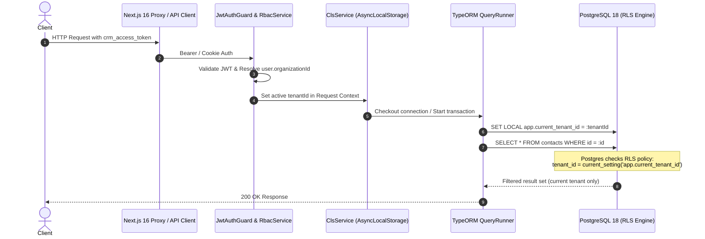

# Specification: PostgreSQL Row-Level Security (RLS) & Multi-Tenancy Hardening

- **Status**: Approved
- **Author**: Antigravity & Engineering Team
- **Date**: 2026-10-01
- **Target Area**: `apps/api`, `packages/shared`, PostgreSQL Database

---

## 1. Executive Summary & Problem Statement

Currently, multi-tenant isolation across Relay CRM relies entirely on application-level filtering (`organizationId` / `tenantId` in TypeORM `where` clauses and `.scoped(actor)` methods). 

### Vulnerabilities in the Existing Model:
1. **Human Error Risk**: A single omitted `where` clause in a repository call or query builder leaks data across tenants.
2. **Inconsistent Column Naming**: ~80% of entities use `tenantId` / `tenant_id` (`quotes`, `invoices`, `sales_orders`, `ledger_accounts`, `inventory`), while legacy core entities use `organizationId` / `organization_id` (`contacts`, `customers`, `teams`, `users`, `roles`, `invitations`, `document_templates`).
3. **No Defense-in-Depth**: The PostgreSQL database treats the API connection as a trusted entity with visibility over all rows in all tables.

### The Solution:
We will implement database-enforced **PostgreSQL Row-Level Security (RLS)** with a **fail-closed** policy, coupled with column standardization to `tenant_id` / `tenantId` across all entities and tables, and automated request context injection via `nestjs-cls` (AsyncLocalStorage).

---

## 2. Security Architecture & RLS Model



### PostgreSQL Policies
Every tenant-owned table will have:
1. `ENABLE ROW LEVEL SECURITY;`
2. `FORCE ROW LEVEL SECURITY;` (ensures table owner and application roles are bound to RLS).
3. Universal policy:
```sql
CREATE POLICY tenant_isolation_policy ON "<table_name>"
  FOR ALL
  USING (
    current_setting('app.bypass_rls', true) = 'on'
    OR tenant_id = NULLIF(current_setting('app.current_tenant_id', true), '')::uuid
  )
  WITH CHECK (
    current_setting('app.bypass_rls', true) = 'on'
    OR tenant_id = NULLIF(current_setting('app.current_tenant_id', true), '')::uuid
  );
```

### Fail-Closed Principle
* If `app.current_tenant_id` is unset or empty string, `NULLIF(..., '')` produces `NULL`.
* Since `tenant_id = NULL` evaluates to `UNKNOWN` (falsy in SQL), **PostgreSQL returns 0 rows and blocks inserts**.
* System background workers (e.g. boot-time catalog sync, Temporal activities) must explicitly execute `SET LOCAL app.bypass_rls = 'on'` via a managed helper `runAsSystem()`.

---

## 3. Database Migration Plan

### Step 1: Column Standardization Migration
Rename `organization_id` to `tenant_id` across legacy tables:
* `contacts` (`organization_id` -> `tenant_id`)
* `customers` (`organization_id` -> `tenant_id`)
* `teams` (`organization_id` -> `tenant_id`)
* `users` (`organization_id` -> `tenant_id`)
* `roles` (`organization_id` -> `tenant_id`)
* `invitations` (`organization_id` -> `tenant_id`)
* `document_templates` (`organization_id` -> `tenant_id`)

Update corresponding foreign key constraint names and composite indexes:
* `uq_customers_org_company` -> `uq_customers_tenant_company`
* `idx_teams_org_name` -> `idx_teams_tenant_name`
* `uq_roles_org_slug` -> `uq_roles_tenant_slug`
* `idx_document_templates_org` -> `idx_document_templates_tenant`

*(Note: `organizations.id` remains the primary key of the organizations table).*

### Step 2: RLS Activation Migration
Iterate through all tenant-owned tables and apply:
* `contacts`, `customers`, `teams`, `users`, `roles`, `invitations`, `document_templates`
* `quotes`, `invoices`, `invoice_payments`
* `sales_orders`, `sales_order_lines`, `delivery_notes`, `delivery_note_lines`
* `work_orders`, `work_order_operations`, `time_entries`
* `purchase_orders`, `purchase_order_lines`, `suppliers`, `supplier_materials`, `purchase_policies`
* `supplier_bills`, `supplier_bill_lines`, `bill_payments`
* `finance_accounts`, `expense_claims`, `recurring_expenses`, `category_budgets`, `ledger_accounts`, `journal_entries`, `fx_rates`
* `stock_items`, `stock_locations`, `stock_movements`, `goods_receipts`
* `notifications`, `audit_logs`, `attachments`, `taxes`, `tax_rules`

---

## 4. Application Architecture (`apps/api`)

### 4.1 Request Context Management (`nestjs-cls`)
1. Integrate `ClsModule.forRoot({ global: true, middleware: { mount: true } })`.
2. In `JwtAuthGuard` (or a dedicated `TenantContextInterceptor`), extract `req.user.organizationId` and store in CLS:
   ```typescript
   cls.set('tenantId', req.user.organizationId);
   ```

### 4.2 TypeORM Query Execution Hook
Create a custom TypeORM DataSource subscriber or QueryRunner wrapper:
* Whenever a `QueryRunner` executes queries for an HTTP request:
  - If `tenantId` is present in CLS: execute `SET LOCAL app.current_tenant_id = '<tenantId>';`
  - If `isSystem` is present in CLS: execute `SET LOCAL app.bypass_rls = 'on';`
  - Within transactions, `SET LOCAL` is cleared automatically by Postgres at transaction commit/rollback, ensuring connection pool cleanliness.

### 4.3 System Execution Context (`runAsSystem`)
Create a utility service:
```typescript
@Injectable()
export class TenantContextService {
  constructor(private readonly cls: ClsService) {}

  async runAsSystem<T>(fn: () => Promise<T>): Promise<T> {
    return this.cls.runWith({ isSystem: true }, fn);
  }

  async runWithTenant<T>(tenantId: string, fn: () => Promise<T>): Promise<T> {
    return this.cls.runWith({ tenantId }, fn);
  }
}
```
Used by:
* `RbacService.syncSystemRolesForAllOrganizations()`
* `RbacService.syncPermissionCatalog()`
* Stripe webhook processing (before tenant resolution)
* Temporal background activities

### 4.4 Shared Base Entity
Introduce `TenantBaseEntity` in `apps/api/src/common/entities/base.entity.ts`:
```typescript
export abstract class TenantBaseEntity extends BaseEntity {
  @Column({ name: 'tenant_id', type: 'uuid' })
  tenantId: string;
}

export abstract class TenantSoftDeletableEntity extends SoftDeletableEntity {
  @Column({ name: 'tenant_id', type: 'uuid' })
  tenantId: string;
}
```

---

## 5. Verification & Testing Plan

1. **Unit & Integration Tests**:
   - `test/multi-tenancy-rls.e2e-spec.ts`:
     - Create records for Tenant A.
     - Execute queries under Tenant B context -> assert 0 records returned.
     - Execute queries with raw `.find()` without `where` clause -> assert only current tenant records returned.
     - Execute queries with NO context -> assert 0 records returned (fail-closed check).
     - Execute queries inside `runAsSystem` -> assert all records returned.
2. **Schema Drift Verification**:
   - Run `pnpm check:drift` and update baseline `scripts/drift-baseline.json`.
3. **Double-Entry Bookkeeping Verification**:
   - Run `pnpm check:books` to ensure tenant trial balances remain exactly balanced to zero.
4. **CI Pipeline Pass**:
   - Run `pnpm test` and `pnpm build` across all workspaces (`shared`, `api`, `web`).
