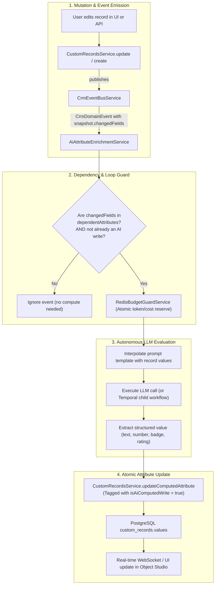

# Phase 2 Design Specification: Attio-Style Dynamic AI Attributes in Object Studio

## 1. Executive Summary & Objective

In modern extensible CRMs (such as Attio and HubSpot), custom records support **dynamically computed AI attributes**. Instead of users manually updating every field or setting up individual workflows for every single property, attributes themselves can be configured with autonomous LLM prompt templates (e.g., *Executive Account Summary*, *Deal Health Score*, *Competitor Threat Level*, *Sentiment & Buying Intent*).

Phase 2 builds directly on the foundations completed in Phase 1:
- **`CrmEventBusService`**: In-memory domain event bus providing `record.created` and `record.updated` events with `before`/`after` snapshots and `changedFields`.
- **`RedisBudgetGuardService`**: Sub-millisecond pre-reservation and rate-limiting against OpenAI / Anthropic model providers.
- **`CustomRecordsService` & `CustomObjectsModule`**: Object Studio engine storing arbitrary attributes inside PostgreSQL JSONB `values`.

---

## 2. Architecture & Event Flow



---

## 3. Detailed Data Models & Contracts

### 3.1 Shared Schema (`packages/shared/src/schemas/custom-object.ts`)

```typescript
export interface AiComputeConfig {
  /** The prompt template evaluated by the LLM. Supports mustache variables like {{ deal_name }} */
  promptTemplate: string;

  /** Target AI Model. Defaults to 'gpt-4o-mini' or tenant default */
  model?: string;

  /** System prompt guiding the evaluation */
  systemPrompt?: string;

  /** List of attribute slugs that trigger recalculation when modified */
  dependentAttributes: string[];

  /** Output format expected from the LLM */
  outputType: 'text' | 'number' | 'boolean' | 'json';

  /** Optional temperature (0.0 to 1.0) */
  temperature?: number;
}

export interface CustomAttributeDefinitionDto {
  id: string;
  objectId: string;
  slug: string;
  name: string;
  type: CustomAttributeType;
  isRequired: boolean;
  isUnique: boolean;
  isAiComputed: boolean;
  aiComputeConfig?: AiComputeConfig | null;
  // ... other existing fields
}
```

### 3.2 TypeORM Entity Extension (`apps/api/src/modules/custom-objects/entities/custom-attribute-definition.entity.ts`)

```typescript
@Column({ name: 'is_ai_computed', type: 'boolean', default: false })
isAiComputed: boolean;

@Column({ name: 'ai_compute_config', type: 'jsonb', nullable: true })
aiComputeConfig: AiComputeConfig | null;
```

---

## 4. Key Backend Services

### 4.1 Loop Prevention Strategy (`isAiComputedWrite`)
To prevent infinite re-computation loops (where updating an AI attribute triggers a `record.updated` event, which re-evaluates the AI attribute indefinitely):
1. In `CrmDomainEvent`, add an optional metadata property `metadata?: { isAiEnrichment?: boolean }`.
2. When `AiAttributeEnrichmentService` updates the computed value, it passes `metadata: { isAiEnrichment: true }`.
3. In `AiAttributeEnrichmentService.handleEvent`:
   ```typescript
   if (event.metadata?.isAiEnrichment) {
     return; // Shield against recursive self-triggering
   }
   ```
4. Even if metadata is absent, verify that `event.snapshot.changedFields` strictly intersects with `aiConfig.dependentAttributes`. Since an AI attribute never depends on itself, writes to it will never trigger re-evaluation.

### 4.2 `AiAttributeEnrichmentService` (`apps/api/src/modules/custom-objects/services/ai-attribute-enrichment.service.ts`)
- Implements `OnModuleInit` and `OnModuleDestroy`, subscribing to `CrmEventBusService`.
- Filters events for `entityType === 'custom_object'`.
- Queries `CustomAttributeDefinition` for the object where `isAiComputed = true`.
- Evaluates field intersection:
  ```typescript
  const needsRecompute = attr.aiComputeConfig.dependentAttributes.some(dep => 
    event.snapshot.changedFields.includes(dep)
  );
  ```
- Interpolates the template against `event.snapshot.after` using Mustache or RegEx substitution.
- Invokes provider using `RedisBudgetGuardService` reservation.
- Persists result using a dedicated `saveComputedValue(tenantId, objectSlug, recordId, attrSlug, value)` method.

---

## 5. Frontend & Object Studio UI (`apps/web`)

### 5.1 Object Studio Attribute Drawer
- Add an **"AI Computed Attribute"** switch to the attribute creation drawer.
- When enabled:
  - **Prompt Template Editor**: Rich textarea with auto-completing pill chips for available attributes on the object (`{{ company_name }}`, `{{ arr }}`, `{{ notes }}`).
  - **Dependent Attributes Multi-Select**: Checkboxes for attributes that should trigger a re-run when changed.
  - **Live Preview / Test Runner**: Allows admin to select any sample record and test the prompt against live data to verify the LLM output before saving the attribute definition.

---

## 6. Migration & Rollout Plan

1. **Migration**: Add `is_ai_computed` (boolean default false) and `ai_compute_config` (jsonb nullable) to `custom_attribute_definitions`.
2. **Backward Compatibility**: All existing custom attributes default to `isAiComputed = false`.
3. **No Schema Drift**: Follow repo rule — foreign keys named with `FK_...`, indices registered in baseline.
